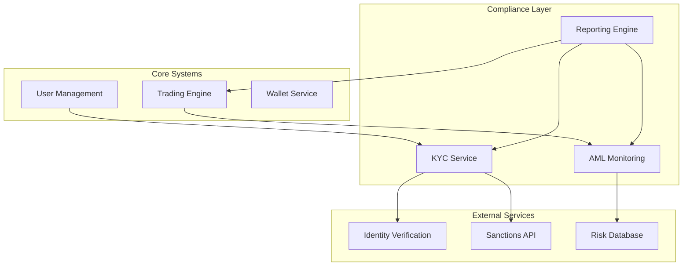

# 1. Specific Implementation Examples

## KYC Implementation
```typescript
// User verification service
class UserVerificationService {
    async verifyIdentity(userData: UserData): Promise<VerificationResult> {
        const documentVerification = await this.verifyDocuments(userData.documents);
        const sanctionsCheck = await this.checkSanctionsList(userData);
        const pepCheck = await this.checkPEPStatus(userData);
        
        return {
            status: this.calculateVerificationStatus({
                documentVerification,
                sanctionsCheck,
                pepCheck
            }),
            riskScore: this.calculateRiskScore(userData),
            verificationDetails: {
                documentsVerified: documentVerification.verified,
                sanctionsStatus: sanctionsCheck.status,
                pepStatus: pepCheck.status
            }
        };
    }

    private async calculateRiskScore(userData: UserData): Promise<number> {
        const factors = {
            countryRisk: await this.getCountryRisk(userData.country),
            activityRisk: this.assessActivityRisk(userData.activity),
            profileRisk: this.assessProfileRisk(userData.profile)
        };
        
        return this.riskScoringAlgorithm(factors);
    }
}
```

## Transaction Monitoring
```typescript
class TransactionMonitor {
    private readonly alertThresholds = {
        SINGLE_TRANSACTION: 10000,
        DAILY_AGGREGATE: 50000,
        VELOCITY_THRESHOLD: 5 // transactions per minute
    };

    async monitorTransaction(transaction: Transaction): Promise<AlertResult[]> {
        const alerts: AlertResult[] = [];
        
        // Real-time checks
        if (await this.exceedsThresholds(transaction)) {
            alerts.push(await this.createAlert('THRESHOLD_EXCEEDED', transaction));
        }

        // Pattern analysis
        const patterns = await this.analyzePatterns(transaction);
        if (patterns.suspicious) {
            alerts.push(await this.createAlert('SUSPICIOUS_PATTERN', transaction));
        }

        // Velocity checks
        const velocity = await this.calculateVelocity(transaction.userId);
        if (velocity > this.alertThresholds.VELOCITY_THRESHOLD) {
            alerts.push(await this.createAlert('HIGH_VELOCITY', transaction));
        }

        return alerts;
    }
}
```

## Regulatory Reporting
```python
class RegulatoryReportGenerator:
    def generate_daily_report(self, date: datetime) -> Report:
        transactions = self.fetch_daily_transactions(date)
        alerts = self.fetch_daily_alerts(date)
        
        report = Report(
            type=ReportType.DAILY,
            date=date,
            sections=[
                self.generate_transaction_summary(transactions),
                self.generate_alert_summary(alerts),
                self.generate_risk_metrics(transactions, alerts)
            ]
        )
        
        return self.format_report(report)

    def format_report(self, report: Report) -> FormattedReport:
        if report.destination == ReportDestination.REGULATOR:
            return self.format_regulatory_xml(report)
        elif report.destination == ReportDestination.INTERNAL:
            return self.format_internal_pdf(report)
```

# 2. Technical Infrastructure Integration

## Architecture Diagram


## Integration Points
```yaml
Trading System Integration:
  Pre-Trade Checks:
    - User verification status
    - Risk level verification
    - Trading limits check
    - Pattern analysis
    
  Post-Trade Monitoring:
    - Transaction reporting
    - Pattern detection
    - Limit updates
    - Risk reassessment

User Management Integration:
  Onboarding Flow:
    - Initial KYC check
    - Document verification
    - Risk assessment
    - Limit assignment
    
  Ongoing Monitoring:
    - Status updates
    - Document renewals
    - Risk reassessment
    - Activity monitoring
```
