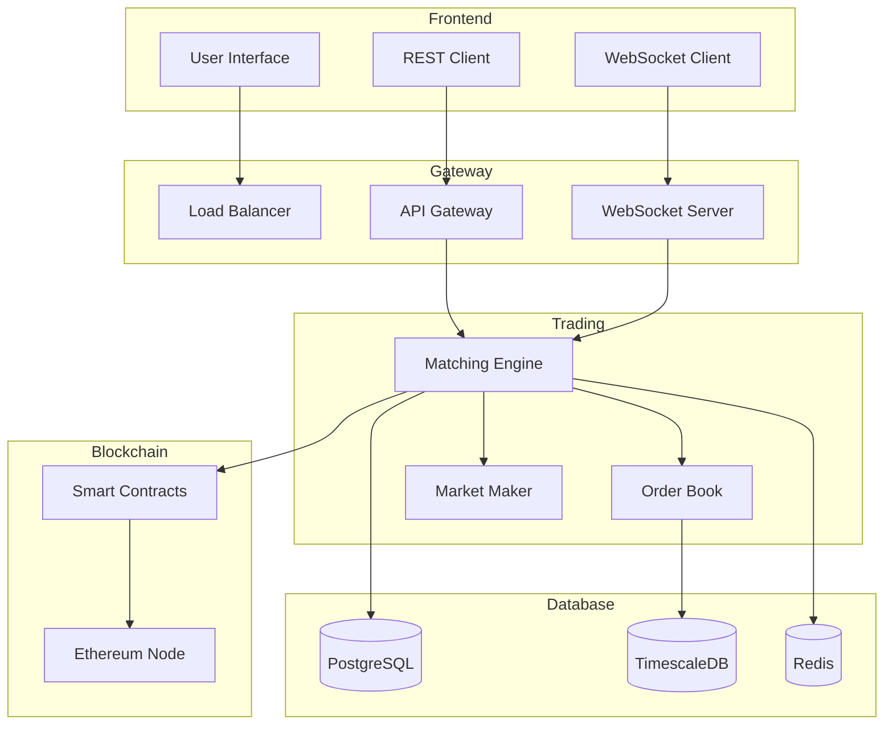
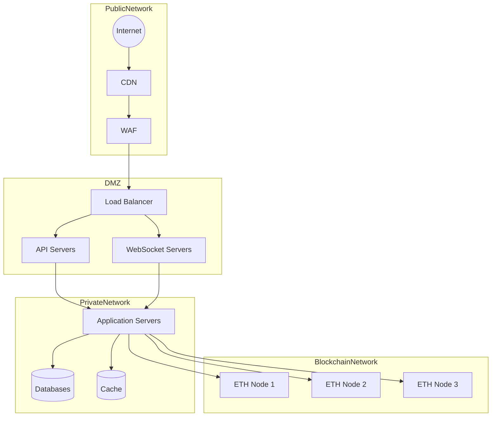

# 1. Core Implementation Details

## Smart Contract Implementation

### Order Matching Engine
```solidity
contract OrderMatchingEngine {
    struct Order {
        uint256 id;
        address trader;
        uint256 price;
        uint256 quantity;
        uint256 timestamp;
        OrderType orderType;
        OrderStatus status;
    }

    // Memory-optimized order book implementation
    mapping(uint256 => Order) public buyOrders;
    mapping(uint256 => Order) public sellOrders;
    
    // Price level tracking for efficient matching
    mapping(uint256 => uint256) public buyOrdersByPrice;
    mapping(uint256 => uint256) public sellOrdersByPrice;
    
    // Events for order lifecycle
    event OrderCreated(uint256 indexed orderId, address indexed trader);
    event OrderMatched(uint256 indexed buyOrderId, uint256 indexed sellOrderId);
    event OrderCancelled(uint256 indexed orderId);

    function placeOrder(
        uint256 price,
        uint256 quantity,
        OrderType orderType
    ) external returns (uint256) {
        // Order validation and placement logic
        require(price > 0, "Invalid price");
        require(quantity > 0, "Invalid quantity");
        
        // Create order and attempt matching
        uint256 orderId = _createOrder(price, quantity, orderType);
        _attemptMatching(orderId);
        
        return orderId;
    }

    function _attemptMatching(uint256 orderId) internal {
        Order storage order = orders[orderId];
        
        // Matching logic implementation
        if (order.orderType == OrderType.BUY) {
            _matchBuyOrder(order);
        } else {
            _matchSellOrder(order);
        }
    }
}
```

### Custody Management
```solidity
contract CustodyManager {
    // Asset tracking with double-entry bookkeeping
    mapping(address => mapping(address => uint256)) private balances;
    mapping(address => mapping(address => uint256)) private pendingDeposits;
    mapping(address => mapping(address => uint256)) private pendingWithdrawals;

    // Multi-signature requirements
    mapping(bytes32 => MultiSigRequest) private multiSigRequests;
    mapping(address => bool) private operators;

    struct MultiSigRequest {
        bytes32 operationHash;
        uint256 requiredSignatures;
        uint256 obtainedSignatures;
        mapping(address => bool) hasSignedBy;
        bool executed;
        uint256 deadline;
    }

    function initiateWithdrawal(
        address token,
        uint256 amount,
        address recipient
    ) external returns (bytes32) {
        // Withdrawal initiation logic
        require(balances[msg.sender][token] >= amount, "Insufficient balance");
        
        bytes32 withdrawalId = keccak256(
            abi.encodePacked(
                msg.sender,
                token,
                amount,
                recipient,
                block.timestamp
            )
        );
        
        // Create multi-sig request
        _createMultiSigRequest(withdrawalId);
        
        return withdrawalId;
    }
}
```

# 2. Architectural Diagrams

## System Architecture


## Network Architecture


# 3. Test Scenarios

## Functional Testing Suite
```yaml
Order Management:
  Place Order:
    Test Cases:
      - Valid market buy order
      - Valid limit sell order
      - Invalid price (0 or negative)
      - Invalid quantity
      - Insufficient balance
      - Price out of range
    
  Cancel Order:
    Test Cases:
      - Cancel valid pending order
      - Cancel partially filled order
      - Cancel non-existent order
      - Cancel other user's order
      
  Modify Order:
    Test Cases:
      - Modify price of pending order
      - Modify quantity of pending order
      - Modify filled order
      - Invalid modifications

Order Matching:
  Market Orders:
    Test Cases:
      - Full fill at single price level
      - Partial fill at multiple prices
      - No liquidity available
      - Maximum slippage exceeded
    
  Limit Orders:
    Test Cases:
      - Immediate full match
      - Partial match and queue
      - No immediate match
      - Multiple partial matches

Performance Tests:
  Latency Tests:
    Scenarios:
      - Single order placement
      - Bulk order placement
      - Market data updates
      - Order book updates
    Metrics:
      - Average latency
      - 95th percentile
      - 99th percentile
      - Maximum latency

  Throughput Tests:
    Scenarios:
      - Maximum orders per second
      - Maximum matches per second
      - Maximum market data updates
      - System capacity under load
```

Would you like me to proceed with a deep dive into the compliance framework next?